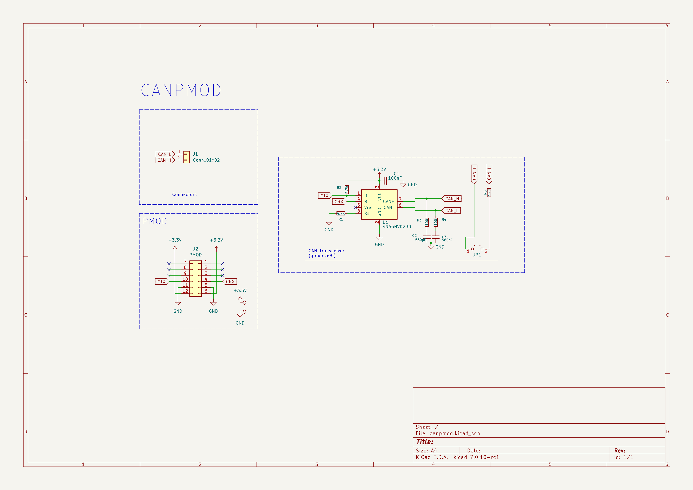
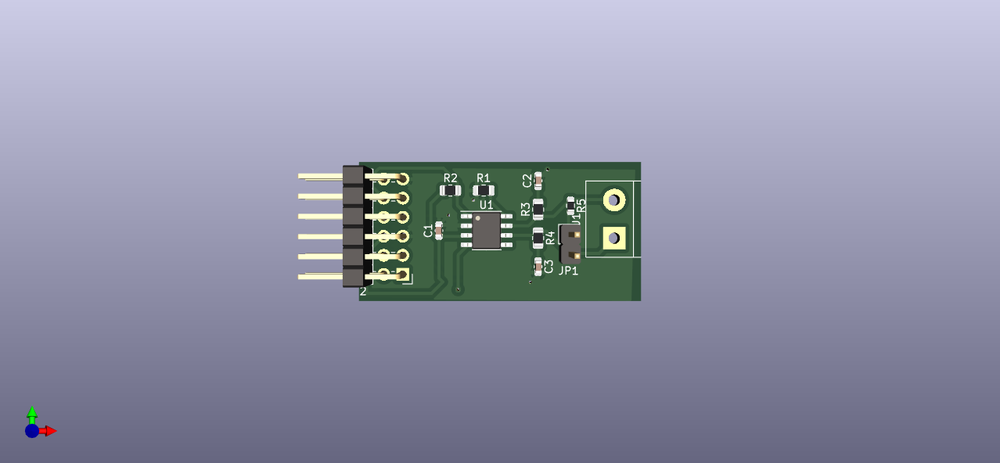

# CAN PMOD

The CAN PMOD is a PMOD-compatible board based on the [SN65HVD230 CAN Board
](https://www.waveshare.com/sn65hvd230-can-board.htm/).

## PMOD Connections

|PMOD|PIN|Function|
|-|-|-|
|1|NC|--|
|2|NC|--|
|3|NC|--|
|4|CAN RX|CAN Receive|
|5|GND||
|6|3.3V||
|7|NC||
|8|NC||
|9|NC||
|10|CAN TX| CAN Transmit|
|11|GND||
|12|3.3V||
